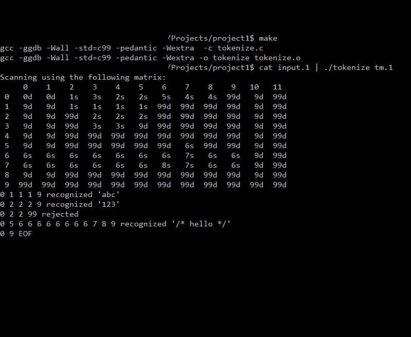

# tokenizer
This project is for course - writeup and explanation of transition matrix format is not available. The project builds a finite state automata given a file representing a transition matrix and processes tokens from input using the created automata.

## Build
`make`

## Run
`./tokenize tm.1`

## Example

